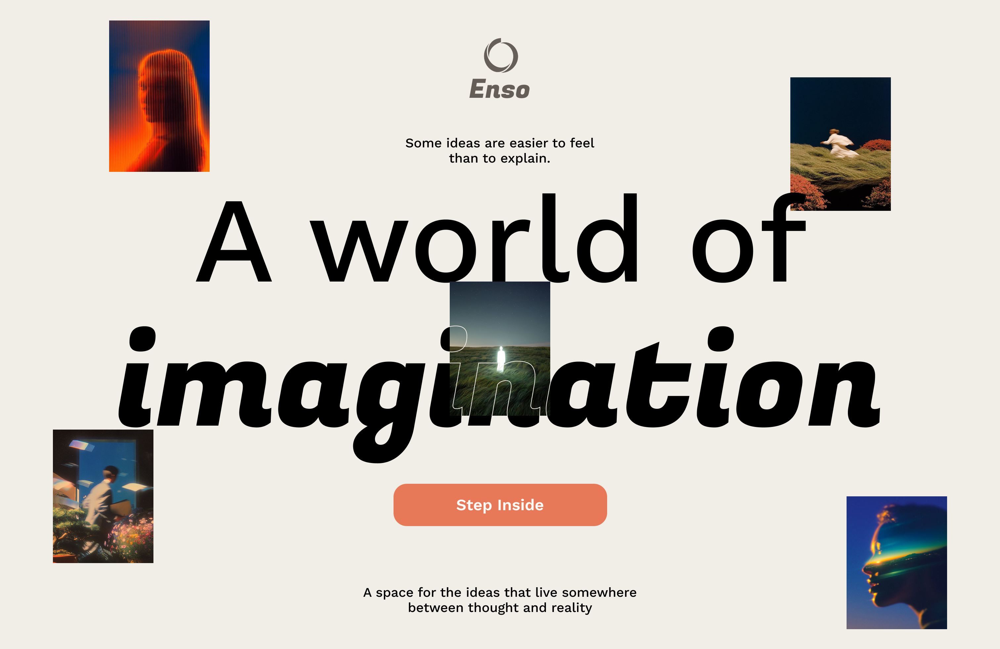

# enso


## Table of Contents

- [Introduction](#introduction)
- [Features](#features)
- [Installation](#installation)
- [Usage](#usage)

## Introduction
enso is a full-stack AI image generation app: React + TypeScript frontend, Express + TypeScript backend, MongoDB + Cloudinary storage, and Cloudflare Workers AI (FLUX.1 Schnell) for generation.

---
## Features
- **Text-to-Image Generation**: Generate images from text prompts using Cloudflare Workers AI with the FLUX.1 Schnell model.

- **Gallery & Sharing**: Browse generated images in a responsive gallery with search/filter. Share your creations by saving them to the gallery.

- **Responsive Design**: Built with Tailwind CSS for a seamless experience across devices.

## Installation

1. Clone the repository
      ```bash
      git clone https://github.com/hualocson/AI-image-generator.git
      ```
2. Navigate to the server directory:
      ```bash
      cd AI-image-generator/server
      ```
3. Install the required dependencies for server:
      ```bash
      npm install
      ```
4. Navigate to the client directory:
      ```bash
      cd ../client
      ```
5. Install the required dependencies for client:
      ```bash
      npm install
      ```

---
## Usage

1. Set up your environment variables in `server/.env`:
   ```env
   CF_API_KEY=your_cloudflare_api_token
   CF_ACCOUNT_ID=your_cloudflare_account_id
   CLOUDINARY_CLOUD_NAME=your_cloudinary_cloud_name
   CLOUDINARY_API_KEY=your_cloudinary_api_key
   CLOUDINARY_API_SECRET=your_cloudinary_api_secret
   MONGO_URL=your_mongodb_connection_string
   ```

2. Start the server:
   ```bash
   cd server && npm run dev
   ```

3. Start the client (in a separate terminal):
   ```bash
   cd client && npm run dev
   ```

4. Open http://localhost:5173 to use enso.
